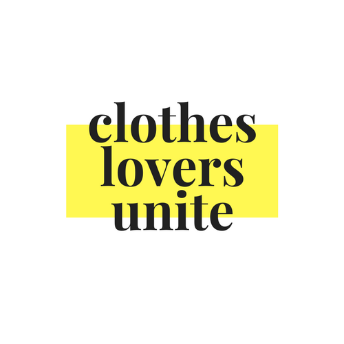
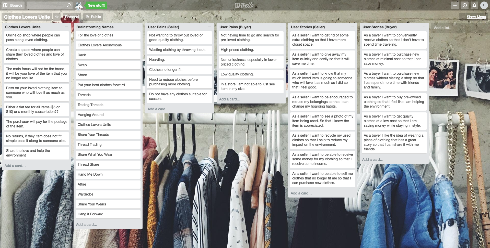
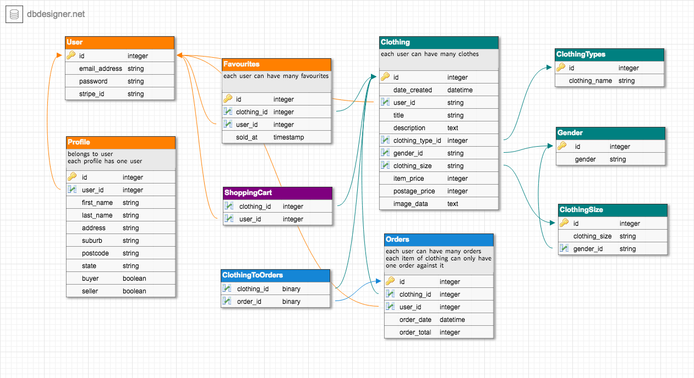
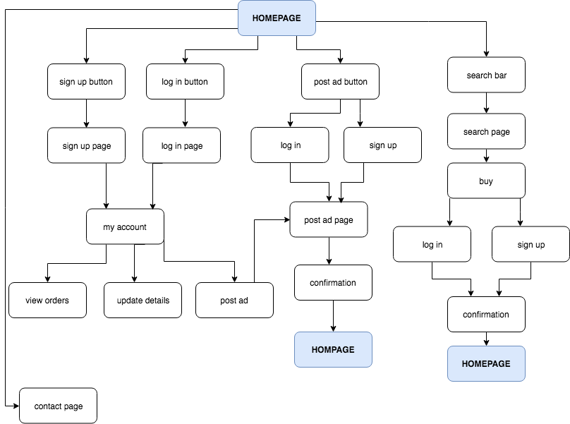
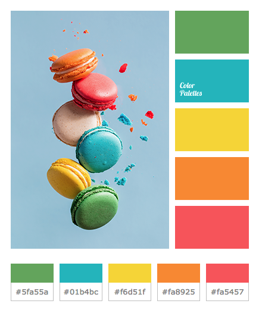
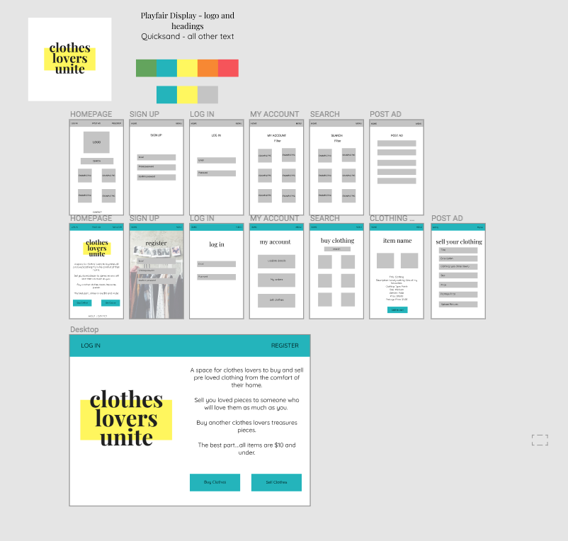

# Clothes Lovers Unite

https://clothesloversunite.herokuapp.com/

https://github.com/lindseyteal/clothesloversunite

## The Problem

There are a number of problem that I set out to solve with my app:
- Many used clothing stores, especially in Melbourne have become quite expensive. 
- The fast fashion industry is bad for the enviornment and often leads to overseas workers being underpaid and treated badly.
- People struggling to give away loved items of clothing.

Compliling a list of user pains for both buyers and sellers was very useful in helping to define the problem.

## The Solution

Clothes Lovers Unite!

- A place where people can sell their loved clothes knowing that someone else will love them as much as they did. 
- Great for the environement as it promotes recycling. 
- Keeping cost of clothing low as items are capped at $10.

## Planning

### User Stories

I used Trello to complie all of my user stories. This process really made me think about my app and what users would want from it. It made me ralised how much thought is required to make sure each user has a pleasant experience on the site. Keeping in mind that they are not all seeking the same experience.

I was really grateful that I was able to brainstorm my app during class time when we were learning about user stories. My team mates came up with many different ideas and questions about the app and it's purpose which was really helpful.

All of my user stories are listed on Trello.

https://trello.com/b/bl5Iqa3K/clothes-lovers-unite

### Brainstorming App Names

I also used Trello to brainstorm names for the app. I wrote down key words that came to mind when thinking of what I wanted to create. My original app idea was for trading or swapping clothes. For the sake of this project it was best to have users simple buying and selling items. A lot of my names used the words swapping or trading, as this is not the purpose of the app I decided to steer aways from these conitations. I decided upon 'Clothes Lovers Unite' as my target audience is people who love and appreciate their clothes. The use of the word unite is to create a sense of community and sharing.

### Enitiy Relationship Diagram (ERD)

 Database Designer was used to create my ERD. I started my ERD and then moved onto a flow diagram for the site. This helped me to figure out sections that I had missed on the ERD.

In hindsight I wish I had taken more care in naming my tables as this caused me issues in the development process.

https://www.dbdesigner.net/designer/schema/167913

### Flow Diagram

This process was a lot harder than I had expected. I realsied how much thought goes into websites and where to send users with each click. My aim is to make the app user friendly and easy to navigate. I wanted to reduce the amount of clicks that was required to get to each feature. This was a really useful step in the planning process.

## Design

### Design Decisions

I did not spend a great amount of time on the design process. I found the logo on Canva and then used that as inspiration for the rest of the design process. My aim was to make it simple, clean and fun.

I found this colour palette and adjusted the yellow to the one from the logo. I thought I may have needed the additional colours for accents, but just decided to go with two colours in the final design.

http://colorpalettes.net/color-palette-3694/

The chose the font used in the headings from the logo found on Canva and then selected another fun font to compliment it for the text in the body of the site.

### Wireframes

As with design I wanted to make the layout simple and easy to read and navigate and also something simple for me to create as I knew I would be spending most of my time writing the code. Figma was used to create the wireframes.

https://www.figma.com/file/NXqZTOvc2GmNlKubTyKIXY9j/Clothes-Lovers-Unite

## Development Process

As there were a number of aspects to the project it would have been easy to get overwhelmed and sidetracked. I tried to keep myself focused on one task at a time and set myself daily goals.

I should have used Trello to track my progress and tasks, but instead opted for the 'old fashioned' pen and paper method and wrote myself daily lists.

Often things do not go to plan so it was important to re-adjust your priorities each day.

### Code Review

I am so grateful for the assistance I received from the teacher and   from many classmates who happily gave up their time to assist when needed. I also appreciated everyone who checked in and asked how everything was tracking. 

Mill kindly assisted me with getting Shrine up and running.

Cameo and Gen helped with debugging sessions.

On the final day I was happy that I have able to provide some assiatance to Steve in order to get Stripe functioning on his app.

## Future Developments

- Add shopping cart and favourites feature
- Add pundit and tighten up devise
- Would love for people who ahve purchased items to be able to post photos of themselves wearing purchased items
- Messaging system between

## Summary

I am really proud of what I have achieved with this project. I found it quite difficult to start with and spent some time doing some tutorials to further my understanding of the relationships between features. 

I feel as though I have learnt a lot about Rails and now feel much more confident using it for future projects.

During this project I was reminded about how important attitude and midset are when trying to achieve anything. Staying positive and believing in yourself goes a long way!